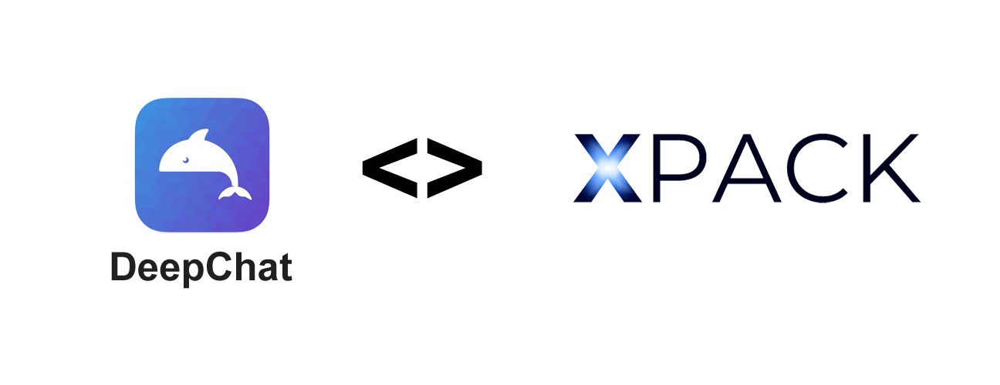
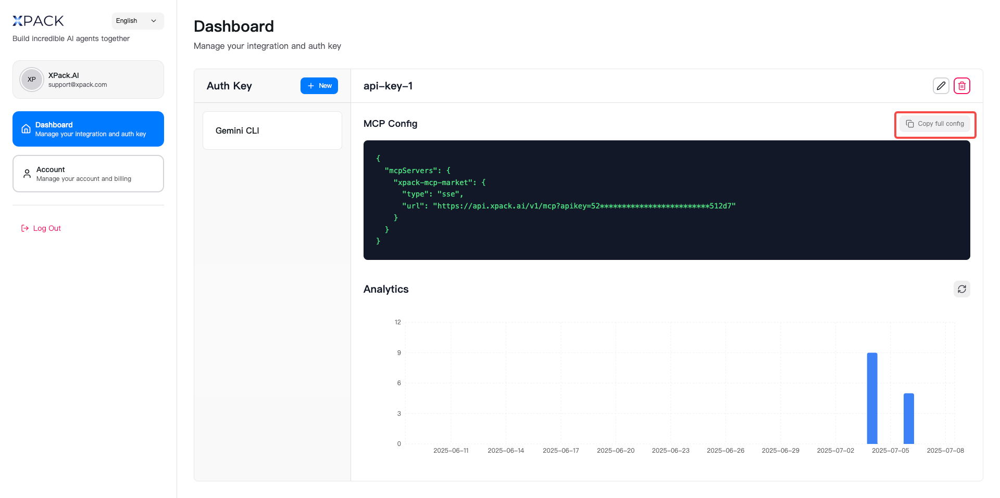
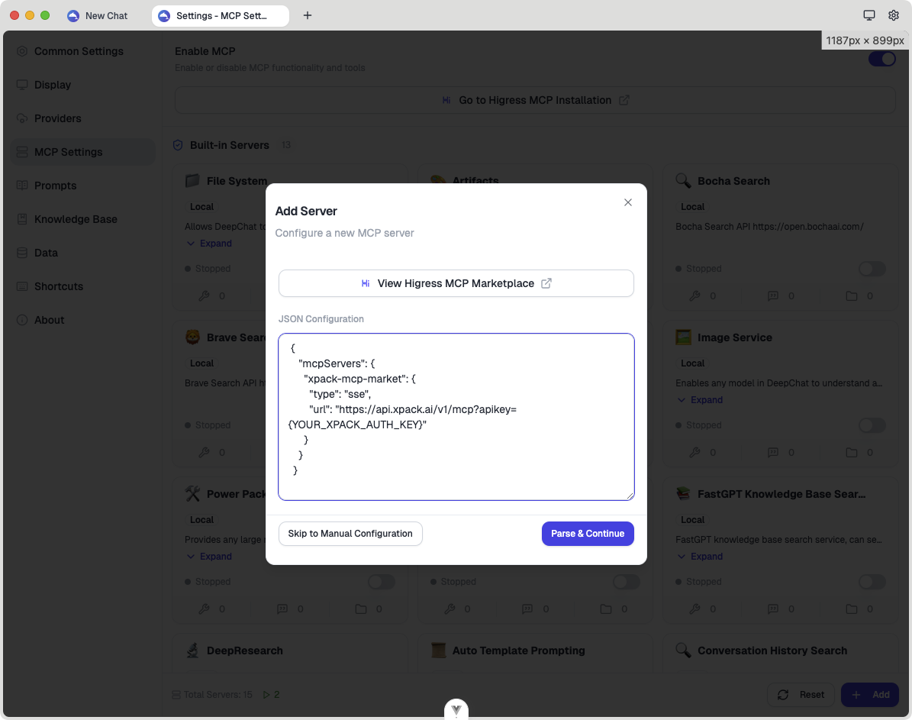
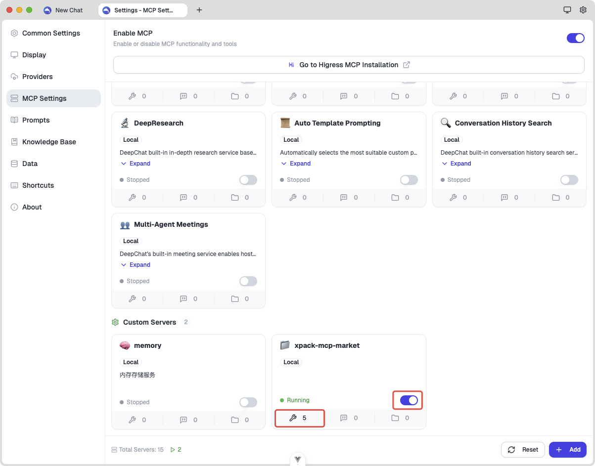
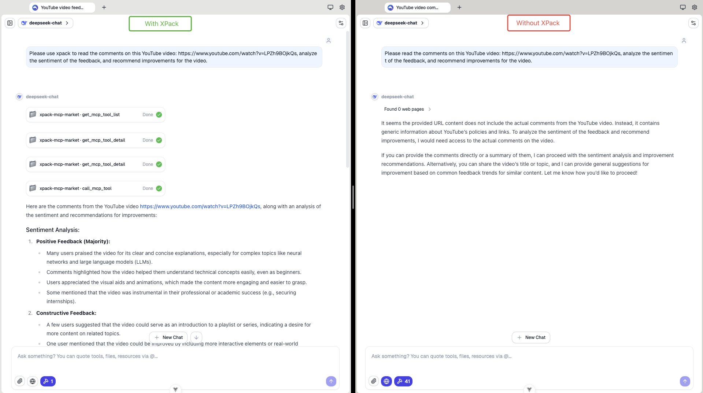
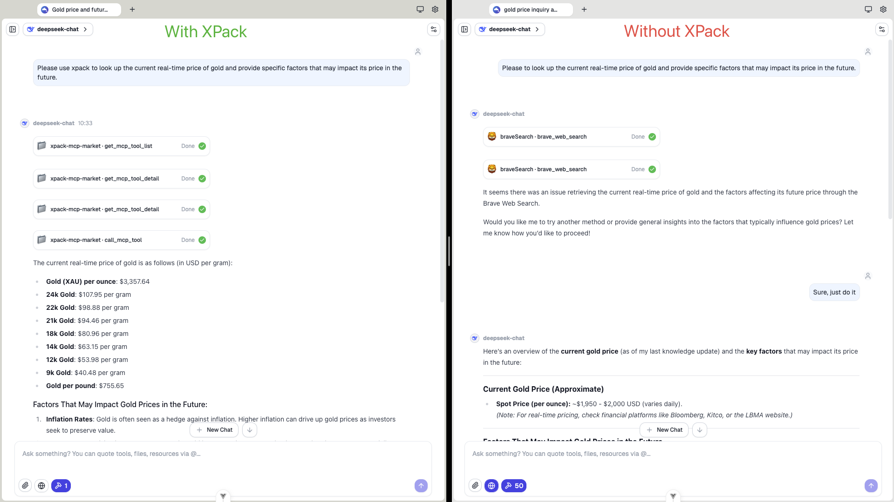
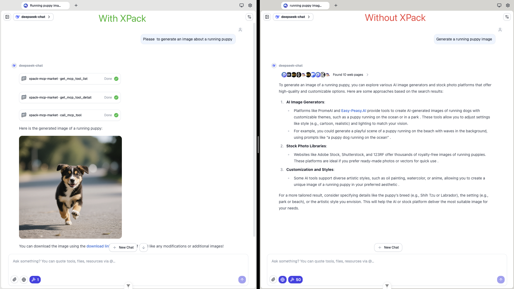
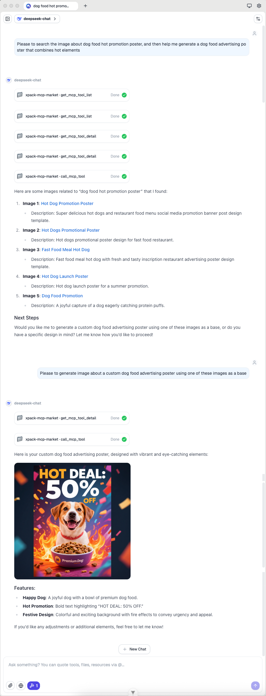

<div align="center">




</div>
<p align="center">
  <a href="https://github.com/ThinkInAIXYZ/deepchat/blob/main/LICENSE"></a>
</p>
<div align="center">
  <a href="./README.zh.md">中文</a> / <a href="./README.md">English</a> / <a href="./README.jp.md">日本語</a>
</div>

## Introduction

This repository showcases the powerful integration of **DeepChat** with **XPack.AI**, demonstrating how you can extend the capabilities of your AI assistant by connecting to thousands of ready-to-use tools worldwide. <mcreference link="https://deepchat.thinkinai.xyz/" index="0">0</mcreference> Building upon the robust foundation of [DeepChat](https://deepchat.thinkinai.xyz/) - a feature-rich open-source AI chat platform supporting multiple cloud and local large language models - this project provides a practical example of configuring its Model Context Protocol (MCP) service to leverage XPack's extensive service marketplace. <mcreference link="https://xpack.ai" index="1">1</mcreference>

## What is DeepChat?

[DeepChat](https://deepchat.thinkinai.xyz/) is a powerful open-source AI chat platform providing a unified interface for interacting with various large language models. <mcreference link="https://deepchat.thinkinai.xyz/" index="0">0</mcreference> Whether you're using cloud APIs like OpenAI, Gemini, Anthropic, or locally deployed Ollama models, DeepChat delivers a smooth user experience with advanced features.

**Key Features:**

- **Unified Multi-Model Management**: One application supports almost all mainstream LLMs, eliminating the need to switch between multiple apps
- **Seamless Local Model Integration**: Built-in Ollama support allows you to manage and use local models without command-line operations
- **Advanced Tool Calling**: Built-in MCP support enables code execution, web access, and other tools without additional configuration
- **Powerful Search Enhancement**: Support for multiple search engines makes AI responses more accurate and timely
- **Privacy-Focused**: Local data storage and network proxy support reduce the risk of information leakage
- **Business-Friendly**: Embraces open source under the Apache License 2.0, suitable for both commercial and personal use

## What is XPack.AI?

[XPack.AI](https://xpack.ai/) is a platform that enables AI agents to connect to a vast ecosystem of global services and tools through a unified Model Context Protocol (MCP). <mcreference link="https://xpack.ai" index="1">1</mcreference> With XPack, you can effortlessly expand your AI agent's functionalities, accessing diverse APIs and services across various domains like finance, logistics, messaging, and more, all in under a minute.

## DeepChat + XPack: Bridging AI with Global Services

This project focuses on demonstrating how to configure DeepChat to utilize XPack as an MCP server. By doing so, your DeepChat instance gains immediate access to XPack's rich collection of tools, allowing you to:

- **Access a diverse range of services:** From financial data to image processing, integrate capabilities that were previously out of reach
- **Accelerate development:** Rapidly prototype and build AI-powered solutions by leveraging pre-built tools
- **Streamline workflows:** Automate complex tasks by combining DeepChat's intelligence with XPack's external service integrations
- **Scale effortlessly:** Connect to thousands of global services without writing custom integration code

### Architecture Overview

```
┌─────────────────┐    ┌──────────────────┐    ┌─────────────────┐
│   User Input    │    │    DeepChat      │    │   XPack.AI      │
│   (Web/Desktop) │◄──►│                  │◄──►│   Marketplace   │
└─────────────────┘    │  ┌─────────────┐ │    │                 │
                       │  │ MCP Client  │ │    │  ┌─────────────┐│
┌─────────────────┐    │  │             │ │    │  │1000+ Global ││
│  Local Tools    │◄──►│  │ • XPack     │ │    │  │Services     ││
│  & Resources    │    │  │ • Local     │ │    │  │• Finance    ││
└─────────────────┘    │  │ • Custom    │ │    │  │• Social     ││
                       │  └─────────────┘ │    │  │• Data       ││
┌─────────────────┐    │  ┌─────────────┐ │    │  │• AI/ML      ││
│  Multi-Model    │◄──►│  │   Chat      │ │    │  │• Utilities  ││
│  Support        │    │  │ Interface   │ │    │  └─────────────┘│
└─────────────────┘    │  └─────────────┘ │    └─────────────────┘
                       └──────────────────┘

```

**Key Components:**

- **DeepChat Core**: Multi-model AI chat platform with advanced features
- **MCP Client**: Standardized interface for connecting to external tool providers
- **XPack MCP Server**: Gateway to 1000+ global services via unified API
- **Local Tools**: Built-in capabilities like code execution, file system access
- **Multi-Model System**: Support for various cloud and local LLM providers

## Installation

### Download and Install DeepChat

First, ensure DeepChat is installed. Download the latest version for your operating system from the [GitHub Releases page](https://github.com/ThinkInAIXYZ/deepchat/releases).

**📥 Quick Download:**

- **Windows**: Download the `.exe` installer
- **macOS**: Download the `.dmg` installation file
- **Linux**: Download the `.AppImage` or `.deb` installation file

After downloading, run the installer and follow the on-screen instructions to complete the installation.

<table align="center">
  <tr>
    <td align="center" style="padding: 10px;">
      
      <br/>
    </td>
    <td align="center" style="padding: 10px;">
      
      <br/>
    </td>
  </tr>
</table>

_For a more detailed guide on development, project structure, and architecture, please see the [Developer Guide](./docs/developer-guide.md)._

### XPack Integration

To connect your DeepChat to XPack, you need to configure an MCP server. This allows DeepChat to discover and utilize the tools available through XPack.

#### 1. Obtain your XPack Auth Key:

- Visit [XPack.AI](https://xpack.ai/) and sign up for an account
- Generate your Auth key from your XPack dashboard



#### 2. Configure XPack MCP in DeepChat

##### Option A: Through DeepChat Settings UI (Recommended)

Configure MCP through Settings UI:

- Open DeepChat application
- Navigate to the Settings page (⚙️ Setting)
- Switch to the **MCP Setting** tab and click the "Add" button
- In the **Add Server** modal , paste the xpack mcp configuration in the textarea:

  ```json
  {
    "mcpServers": {
      "xpack-mcp-market": {
        "type": "sse",
        "url": "https://api.xpack.ai/v1/mcp?apikey={YOUR_XPACK_AUTH_KEY}"
      }
    }
  }
  ```


##### Option B: Manual Configuration

If you prefer manual configuration, you can also use DeepChat's DeepLink feature for one-click MCP installation:

```
deepChat://mcp/install?code={base64Encode(JSON.stringify(jsonConfig))}
```

⚠️ Replace `YOUR_XPACK_AUTH_KEY` with your actual XPack Auth key from the dashboard.

For detailed MCP configuration instructions, see our [User Guide](./docs/user-guide.md).

#### 3. Run DeepChat with MCP

Once the configuration is complete, it will automatically connect to the XPack MCP server and discover available tools.

### Verifying Configuration

To verify that your XPack MCP integration is working correctly:
1. Enable the MCP server by toggling the switch in the DeepChat MCP Settings panel.
2. Check the tool list:
    - If the connection is successful, the available tools will be displayed below.
    - You can click on any tool to view more detailed information.
    - The presence of a tool list and detailed tool information indicates that the service connection is normal and operational.



If configured correctly, DeepChat will show available XPack tools and be able to use them for various tasks.

#### Usage

You can then input your ideas and prompts in DeepChat, and it will leverage the tools from XPack to accomplish the tasks. Simply mention "use XPack" in your requests to specifically utilize XPack services.

## Popular Tasks

This section provides practical examples of how you can leverage DeepChat with XPack for various tasks.

### Analyze YouTube Comments and Provide Suggestions

Easily analyze YouTube video comments to understand audience sentiment and get suggestions for improving your content.

```
Please use xpack to read the comments on this YouTube video: https://www.youtube.com/watch?v=LPZh9BOjkQs, analyze the sentiment of the feedback, and recommend improvements for the video.
```



### Current Gold Price and Influencing Factors

Quickly check the latest gold price and discover key factors that may affect future trends.

```
Please use xpack to look up the current real-time price of gold and provide specific factors that may impact its price in the future.
```



### Generate Custom Images

Easily create custom images using AI image generation tools through XPack.

```
Generate a running puppy image with xpack
```



### Dog Food Advertising Poster Generation

Easily search for inspiration and generate a custom dog food advertising poster with hot promotional elements.

```
Please to search the image about dog food hot promotion poster, and then help me generate a dog food advertising poster that combines hot elements
```



---

**Ready to supercharge your DeepChat with global services?** Get started with XPack.AI today and unlock the full potential of AI-powered assistance!
